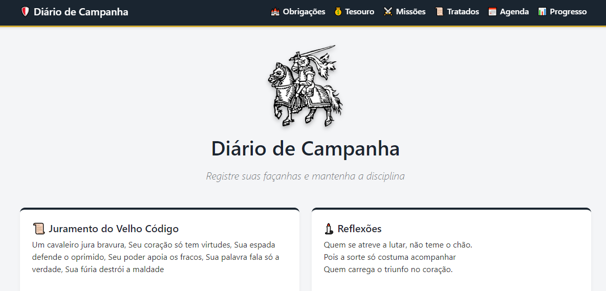
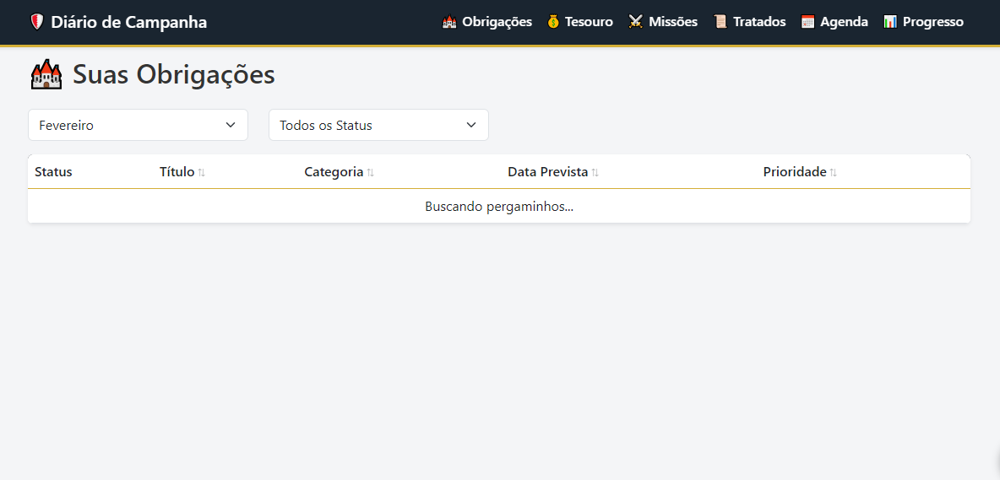
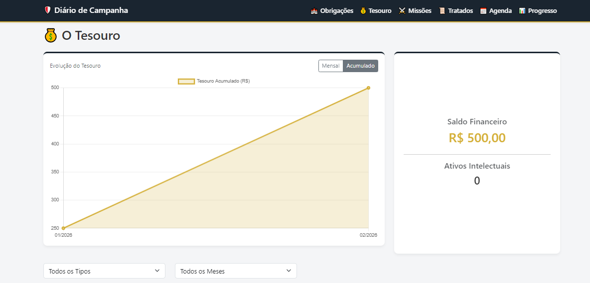
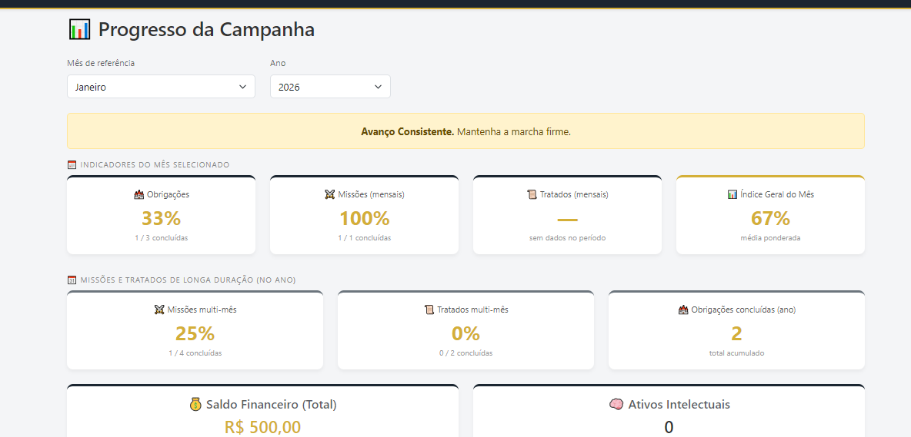
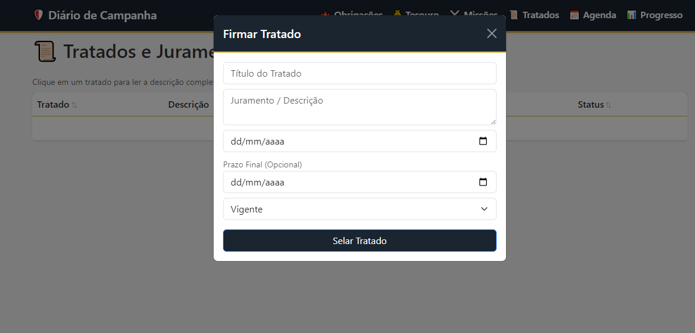

# 🛡️ Diário de Campanha - Sistema Gamificado de Gestão Pessoal

O **Diário de Campanha** é um software de gestão de rotina, metas e finanças pessoais projetado com uma estética levemente inspirada em campanhas medievais. Desenvolvido para funcionar inteiramente no ecossistema Google, ele transforma tarefas diárias em "Obrigações" e metas de longo prazo em "Missões", oferecendo uma experiência de uso engajadora, limpa e responsiva.

## ⚙️ Metodologia

O desenvolvimento deste projeto focou na criação de uma aplicação leve, de alta disponibilidade e sem a necessidade de infraestrutura de servidores complexa. A arquitetura segue o padrão Modelo-Visão-Controlador (MVC) adaptado para o ecossistema Google:

* **Visão (Frontend):** Desenvolvida em HTML5, CSS3 e JavaScript puro, utilizando o framework **Bootstrap 5** via CDN para garantir total responsividade (Mobile e Desktop) em uma estrutura de *Single Page Application* (SPA). Os gráficos são gerados dinamicamente via **Chart.js**.
* **Modelo (Banco de Dados):** O Google Sheets atua como o banco de dados da aplicação de forma *serverless*.
* **Controlador (Backend):** Implementado em **Google Apps Script** (`Code.gs`), responsável por gerenciar o CRUD (Criar, Ler, Atualizar, Deletar), os cálculos de progresso da campanha e a integração nativa com a API do Google Calendar.

## 🏗️ Arquitetura e Integração com a Planilha

Diferente de sistemas tradicionais que usam bancos de dados relacionais estritos, este sistema utiliza o Google Sheets de forma otimizada:

* **Geração Automática:** O script backend possui uma função de *setup* que, ao ser executada pela primeira vez, constrói automaticamente o esquema do banco, gerando as abas de `🏰 OBRIGAÇÕES`, `💰 TESOURO`, `⚔️ MISSÕES`, `📜 TRATADOS`, `📅 AGENDA` e `📊 PROGRESSO`.
* **Comunicação:** O frontend se comunica com a planilha de forma assíncrona através da API nativa `google.script.run`. Os dados da planilha são encapsulados em objetos JSON e enviados à interface.
* **Segurança e Escalabilidade:** Como a planilha fica restrita à conta Google do usuário, a segurança dos dados é garantida pela própria infraestrutura de autenticação do Google.

## 🏆 Resultados

O resultado é um Web App funcional, rápido e sem custos de hospedagem para o usuário final. Ele oferece uma plataforma eficiente para acompanhamento de métricas de sucesso pessoal, gestão de compromissos automatizados com o Google Agenda e controle financeiro, tudo em um painel gamificado e intuitivo.

## 🖥️ Interface do Usuário

*(Substitua os links abaixo pelos caminhos reais das suas imagens dentro da pasta do repositório, ex: `docs/img/home.png`)*

### Tela Inicial (Dashboard)

> *Painel principal com brasão, conselho do dia, reflexões e atalhos rápidos de navegação.*

### Tela de Obrigações

> *Tabela de tarefas com filtros por mês e status, destacando itens concluídos.*

### Tela do Tesouro

> *Gestão financeira e intelectual com gráfico de evolução temporal renderizado via Chart.js.*

### Tela de Progresso

> *Análise de desempenho da campanha com barras de progresso dinâmicas e mensagens de status automatizadas.*

### Formulários de Cadastro (Modais)

> *Interface limpa e sobreposta para inserção de novos registros sem recarregar a página.*

## 🚀 Instalação e Uso

Diferente de aplicações locais, este sistema não requer a instalação do Node.js, MySQL ou hospedagem na sua máquina. Tudo é executado diretamente na nuvem do Google.

### Pré-requisitos
* Uma conta do Google ativa (Gmail ou Workspace).
* Um navegador de internet atualizado.

### Passo a Passo de Implantação

1. **Criação do Banco de Dados:**
   * Acesse o [Google Sheets](https://sheets.google.com) e crie uma nova planilha em branco.
   * Dê o nome que preferir (ex: `Banco de Dados - Diário de Campanha`).

2. **Configuração do Ambiente de Desenvolvimento:**
   * Na planilha, vá no menu superior e clique em `Extensões` > `Apps Script`.
   * Um novo projeto será aberto em uma nova guia.

3. **Inserção do Código:**
   * No arquivo `Code.gs` (ou `Código.gs`), apague o conteúdo padrão e cole todo o código do Backend do repositório.
   * Clique no botão `+` (Adicionar arquivo) ao lado de "Arquivos", escolha **HTML** e nomeie exatamente como `Index` (com "I" maiúsculo).
   * Cole todo o código Frontend (HTML/JS/CSS) do repositório no arquivo `Index.html`.
   * Salve o projeto (ícone de disquete).

4. **Criação Automática das Tabelas:**
   * No arquivo `Code.gs`, selecione a função `setupSystem` no menu suspenso na barra de ferramentas superior.
   * Clique em **Executar**.
   * *Nota: O Google pedirá permissões de acesso (pois o sistema interage com suas planilhas e seu Google Agenda). Aceite os avisos de segurança avançados para permitir a execução.*
   * Volte à sua planilha e verifique se todas as abas foram criadas com cabeçalhos formatados corretamente.

5. **Publicação do Web App:**
   * No canto superior direito do Apps Script, clique em **Implantar** > **Nova implantação**.
   * Clique na engrenagem ao lado de "Selecione o tipo" e marque **App da Web**.
   * Em "Descrição", digite um nome (ex: `Versão 1.0`).
   * Em "Executar como", deixe `Eu`.
   * Em "Quem pode acessar", selecione `Somente eu` (para manter seus dados e calendário privados).
   * Clique em **Implantar**.

6. **Acesso ao Sistema:**
   * O Google fornecerá uma URL (Link do Web App). Este é o seu sistema pronto e rodando.
   * Você pode salvar este link nos favoritos do seu navegador ou adicioná-lo à tela inicial do seu smartphone para acessá-lo como um aplicativo nativo.

---

